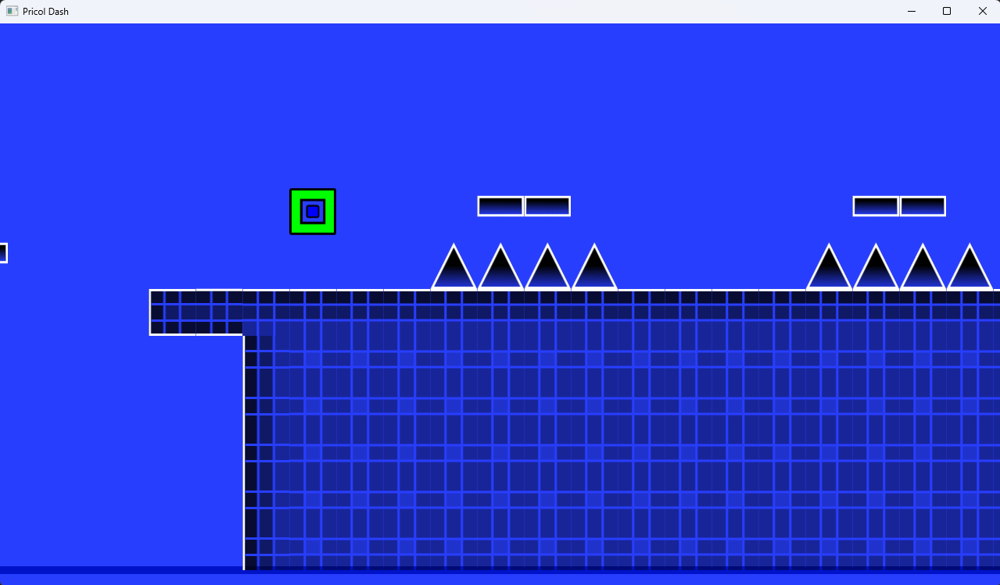
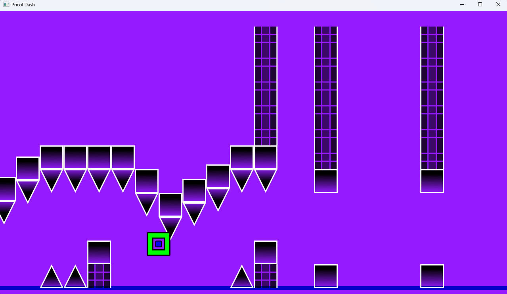

# pricol-dash
An attempt at recreation of GD 1.0 in C
## deps
[xml.c](https://github.com/ooxi/xml.c)  
Box2D  
SDL2  
SPNG (+miniz recommended)  
*Don't forget to configure VS project!*
## screens
  

# running
1) put assets from gd 1.0 into assets dir  
2) copy full_lv.txt into assets dir  
3) run exe from current dir  
4) -_-
